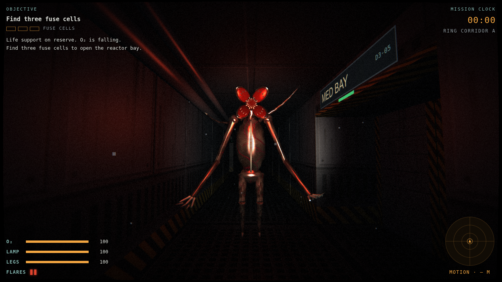
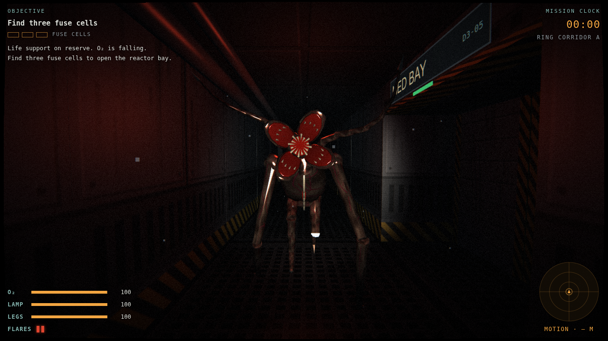

# Vesper-9

A first-person horror game on a failing orbital relay station, built with Three.js in a single `index.html`.

You wake in crew quarters with life support on reserve. Your only way off is **emergency module EM-2**, still clamped to the ring. Recover three fuse cells, restart the reactor, release both docking clamps, then board EM-2 and survive the 15-second separation countdown while something hunts you.

## Play

Open `index.html` in a desktop or mobile browser. It needs WebGL and a network connection for Three.js and the fonts.

| Input | Action |
| --- | --- |
| WASD / arrows | Move |
| Mouse (click to capture) | Look |
| Shift | Run. The creature hears running |
| F | Flashlight. Hold the beam on the creature to drive it back |
| G (or Q) | Throw a flare |
| E | Use terminals, the reactor, docking clamps (hold) and EM-2; hide in lockers |
| Space | Hold your breath while hiding |
| M / Tab | Station map |
| Esc / P | Pause |

On touch screens, drag on the left to move and on the right to look. Use the LIGHT, FLARE, USE, RUN and MAP buttons; hold RUN to hold your breath while hiding.

## The creature

- A tall, veined thing whose head splits into four toothed petals. It stalks upright, stops to stare before it charges, and chases you on all fours.
- It hunts by sound (running is loud, walking is quiet) and by sight, and it clicks as it listens.
- It moves through the **ceiling vents**. You hear it crawling overhead, then it drops out of a vent somewhere near you.
- It blows out lights as it passes under them, and your flashlight stutters when it is close.
- A steady flashlight beam or a burning flare drives it back. It will not cross a flare while it burns.

## Survival systems

- **Oxygen** drains until the reactor is back online. Canisters refill it.
- **Flashlight battery** drains while the light is on, and faster while it burns the creature. Restarting the reactor recharges it.
- **Flares** light an area for 24 seconds and keep the creature out of it.
- **Lockers** hide you. When the creature is close, hold your breath until it leaves. If it sees you get in, it will pull you out.
- **Motion tracker** pings every 1.4 s and shows the creature within range, even when it is in the ducts.
- **Station map** shows the deck plan, where you have been, what you have spotted and the next objective.
- **Crew logs** on five terminals tell the story and hint at how to survive.
- **Difficulty:** *Crew*, or *Nightmare*, where it wakes sooner, moves faster, the tracker range is shorter and you start with one flare.

## The escape

1. Find the three fuse cells to unseal the reactor bay.
2. Restart the reactor. Alarms start, the module bay powers up and the creature hunts you nonstop from then on.
3. Hold E at both docking clamp consoles. The clamps are loud.
4. Board EM-2. The hatch stays open for 15 seconds. Keep the light on the creature until separation.

Textures, the creature model and all sound are generated in code at runtime; there are no asset files.
