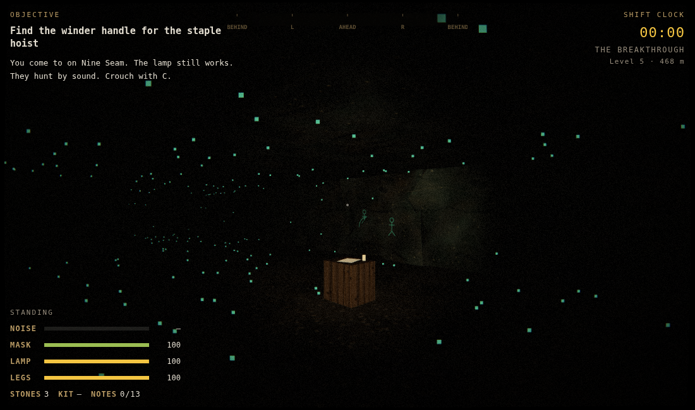
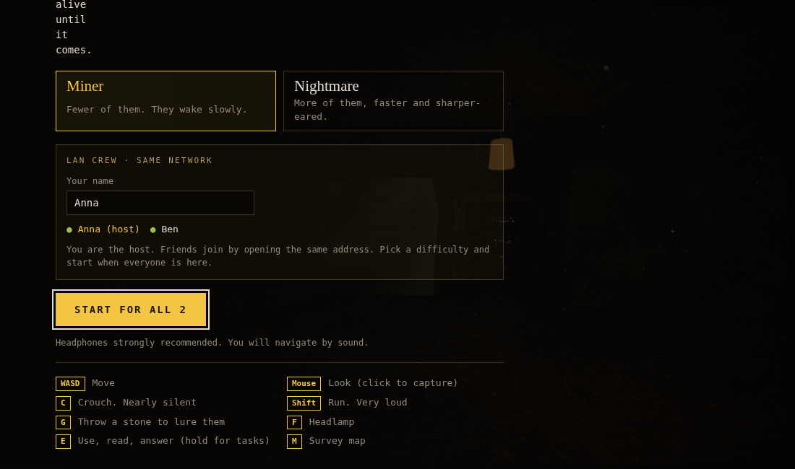

# Blackdamp

A first-person horror escape from a collapsed coal mine, for one player or a crew of up to four on the same network. Built with Three.js; the whole game is `index.html` in this folder.

You wake on Nine Seam, the deepest level of the Hollow Creek Colliery, where the cutters broke into a cavern that should not exist. The men who went near its black pool came back pale, eyeless and wrong. **They are blind and hunt by sound.** Climb three levels to the cage and get out.

## Playing with friends on your network (LAN)

A web page cannot talk to other computers on its own, so one person runs a small server that ships with the game. It has no dependencies beyond Node.js.

1. **One person (the host) installs Node.js** from https://nodejs.org (the LTS version). Only the host needs it.
2. **Get the game folder** onto the host computer: download this repository (Code → Download ZIP on GitHub) and unzip it.
3. **Start the server** from the `mine` folder:
   - Windows: double-click `start-lan-server.bat`. If Windows Firewall asks, allow access on **private networks**.
   - macOS: double-click `start-lan-server.command` (the first time, right-click → Open).
   - Linux or any terminal: `node server.js` (or `node server.js 9000` for another port).
4. The window prints addresses like `http://192.168.1.23:8090`. **Everyone on the same Wi-Fi or network opens that address** in Chrome, Edge or Firefox. The host can use `http://localhost:8090`.
5. Everyone types a name. The first person to connect is the host: they pick the difficulty and press **Start**.

Keep the server window open while you play. Up to 4 players. The game files load from the host, so the LAN game works without internet (fonts fall back to built-in ones).

### How the crew game works

- You all start together on Nine Seam. Progress is shared: the handle, the dynamite, the fuel and the generator count for the whole crew.
- The creatures hear every one of you. Your crewmates’ footsteps, lamps and name tags are visible and audible to you, and the survey map (M) shows where they are.
- If you die, you can watch a living crewmate. If the whole crew dies, the game ends. Whoever reaches the cage escapes.
- The host runs the creatures. If the host leaves, the next player takes over automatically.
- Pausing only pauses your own screen in a LAN game.

## The three levels

1. **Level 5, Nine Seam.** Natural caverns, glowing fungus, ancient carvings that whisper when you get close, and the black pool. Find the winder handle in Mahler’s cabin and ride the staple hoist up. Taking the handle wakes what sleeps in the pool.
2. **Level 4, Haulage.** Find three sticks of dynamite (magazine, the gas-filled old workings, the flooded stope), blast the roof fall, get 10 m clear, and climb the ladderway.
3. **Level 3, Pit bottom.** Stables, chapel, first aid, the deputies’ office and a gas-filled airway. Find the fuel in the stables, fuel and start the hoist generator, ring three bells, and survive 25 seconds until the cage comes down.

## Mystery

- **13 notes** across the three levels tell what the company found on Nine Seam and what it did about it. Find at least 10 for the true ending.
- **Mine telephones** ring on each level. The ringing draws the creatures, so answer fast. The calls come from the surface, and they are not all reassuring.
- **Carvings** in the cavern whisper when you get close.

## Controls

| Input | Action |
| --- | --- |
| WASD / arrows | Move |
| Mouse | Look (click to capture) |
| C (toggle) / Ctrl (hold) | Crouch: slow and nearly silent |
| Shift | Run: very loud |
| G (or Q) | Throw a stone; they go to where it lands |
| F | Headlamp |
| E | Pick up, read, answer phones, use (hold for the charge, generator, hoist and ladder) |
| M / Tab | Survey map of your current level |
| Esc / P | Pause |

Touch: drag left to move, right to look; LAMP, STONE, USE, CROUCH, RUN and MAP buttons.

## How they hunt

- Crouching is nearly silent, walking carries a few metres, running and splashing carry much further. The NOISE meter shows how loud you are. Sound travels along the tunnels, not through rock.
- They scream now and then to echolocate. If one screams close to you with a clear line to you, it finds you. Stand right next to one and it smells you.
- The listening strip at the top of the screen shows what you heard: yellow for footsteps, red for screams.
- Blasts, the generator, the bell and ringing phones are heard across the level.
- Hazards: blackdamp gas drains your rescue mask, flooded workings splash, the roof groans and drops debris, and your lamp battery runs down.
