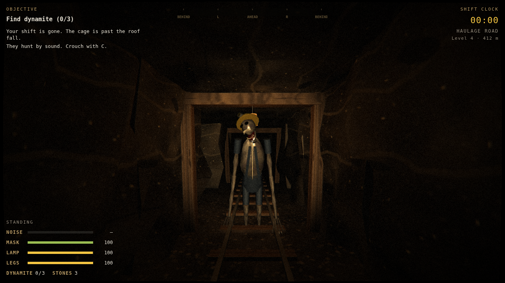

# Blackdamp

A first-person horror game set 412 m underground in the Hollow Creek Colliery. Everything is in this folder's single `index.html`, built with Three.js.

The roof has fallen across the only road to the cage. Things that used to be your crewmates, pale, eyeless and still wearing their helmets, walk the tunnels. **They are blind and hunt by sound.**

## Goal

1. Find three sticks of dynamite: in the powder magazine, the gas-filled old workings and the flooded stope.
2. Pack the charge at the roof fall, light the eight-second fuse and get at least 10 m away.
3. Start the hoist generator on the shaft landing. It is loud.
4. Ring the signal bell. The cage takes 20 seconds to come down, and every one of them comes too.
5. Get in the cage.

## Controls

| Input | Action |
| --- | --- |
| WASD / arrows | Move |
| Mouse | Look (click to capture) |
| C (toggle) / Ctrl (hold) | Crouch: slow and nearly silent |
| Shift | Run: very loud |
| G (or Q) | Throw a stone; they go to where it lands |
| F | Headlamp |
| E | Pick up, read, use (hold for the charge and the generator) |
| M / Tab | Survey map |
| Esc / P | Pause |

Touch: drag left to move, right to look; LAMP, STONE, USE, CROUCH, RUN and MAP buttons.

## How they hunt

- Every step makes noise. Crouching is nearly silent, walking carries a few metres, running and splashing through water carry much further. The NOISE meter shows how loud you are.
- Sound travels along the tunnels, not through rock.
- They scream now and then to echolocate. If one screams close to you with a clear line to you, it finds you.
- Stand right next to one and it smells you.
- The **listening strip** at the top of the screen shows where you heard them: yellow for footsteps, red for screams.
- The dynamite blast, the generator and the bell are heard by all of them.

## Hazards

- **Blackdamp:** green haze in the old workings and part of the south drift. It drains your rescue mask quickly, and when the mask is empty you start coughing (which they hear) and then suffocate.
- **Flooded stope:** slow, and every step splashes.
- **Roof groans:** dust falls and debris clatters somewhere nearby, which draws them.
- Your lamp battery runs down; spares are in the foreman's hut, the lamp room and the old workings.
