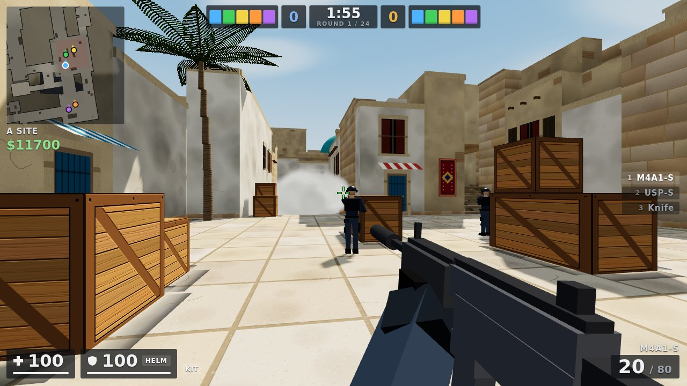
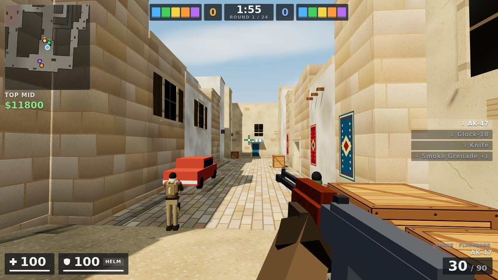
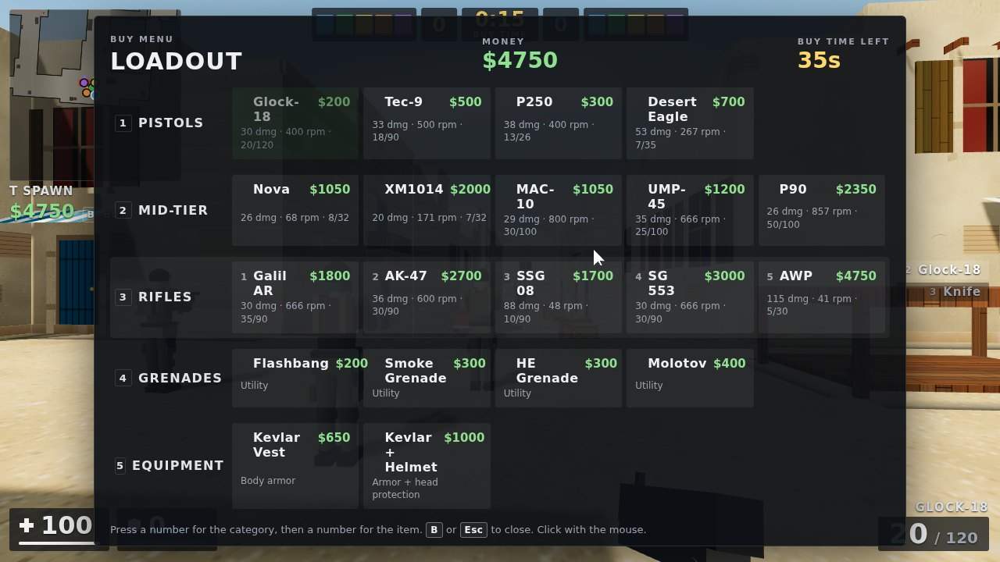

# Mirage 5v5

A browser tactical shooter in the style of Counter-Strike 2's bomb defusal mode, played on a Mirage-inspired map. You play on a team with four bots against five bots. Built with Three.js; the map, textures, models and sounds are all generated in code, so there are no asset files.

This is a fan-made tribute. It is not affiliated with Valve and uses none of their assets.

## Play

Open `mirage/index.html` in a desktop browser (Chrome, Edge or Firefox). It needs WebGL and a network connection to load Three.js and the fonts. Click **Play** to go fullscreen and lock the mouse. In Chrome and Edge, fullscreen also stops shortcuts such as Ctrl+W from closing the tab mid-round; in other browsers you're asked before the tab closes.

In the menu you can set:

- your side: Counter-Terrorists or Terrorists
- match length: first to 13 or first to 9
- bot difficulty: Easy, Normal, Hard or Expert
- graphics quality (drops one level by itself if the frame rate stays low)
- crosshair style (classic static or dynamic) and colour
- sensitivity and volume
- voice: announcer and spoken bot radio, announcer only, or off
- friendly fire

| Input | Action |
| --- | --- |
| WASD | Move |
| Mouse | Look (sensitivity uses the CS2 scale) |
| Mouse 1 | Fire, knife slash, throw grenade, plant (hold with the C4 out) |
| Mouse 2 | Scope (AWP, SSG 08, SG 553, AUG), knife stab, underhand grenade throw |
| Shift | Walk. Walking makes no footstep noise |
| C or Ctrl | Crouch |
| Space | Jump |
| R | Reload |
| E | Defuse (hold, CT); pick up or swap for a weapon you're looking at |
| 1–5, Q, mouse wheel | Primary, pistol, knife, grenades (press again to cycle), C4, last weapon |
| G | Drop your weapon or the bomb |
| B | Buy menu (keys 1–5 then 1–5, or click) |
| Tab | Scoreboard |
| F | Inspect weapon |
| Esc | Pause |

When you are dead: left or right click cycles the player you spectate, and Space toggles first- and third-person views.

## What's in it

**Rules.** CS2 competitive (MR12, first to 13, halftime side swap, draw at 12–12) or a short match (first to 9, draw at 8–8). Freeze time, a 20-second buy window, 1:55 rounds, a 40-second bomb timer, a 3.2-second plant, and a 10-second defuse (5 seconds with a kit).

**Economy.** CS2 values: $800 start, $16,000 cap, round-win rewards by win type, the loss bonus ladder ($1,400 to $3,400), per-weapon kill rewards (SMGs $600, AWP $100, knife $1,500), $300 for planting and defusing, and $800 to the Terrorists when they lose with the bomb planted.

**Weapons.** Glock-18, USP-S, Tec-9, Five-SeveN, P250, Desert Eagle, Nova, XM1014, MAC-10, MP9, UMP-45, P90, Galil AR, FAMAS, AK-47, M4A4, M4A1-S, SG 553, AUG, SSG 08, AWP and the knife. Utility and gear: HE grenade, flashbang, smoke, molotov/incendiary, Kevlar, helmet and defuse kit. Shotguns fire pellet spreads and reload shell by shell; the SG 553 and AUG have a zoom scope. Damage, armour penetration, fire rate, magazine size, reload time, range falloff and movement speed all follow CS2's numbers. Headshots do 4× damage, so an AK-47 one-taps a helmeted player and an M4A4 does not.

**Shooting.** Accuracy comes from standing, crouching, moving and jumping inaccuracy, plus bloom from firing. Running and shooting sprays everywhere; stop (counter-strafe) to shoot accurately. Rifles and SMGs have fixed spray patterns: the AK-47 climbs, then pulls right, then left. Your view kicks up by 45% of the recoil, as in CS2. Bullets go through thin cover such as crates and cars (wallbangs), losing damage. Hits slow the target down.

**Grenades.** Grenades bounce off walls. HE grenades do falloff damage, and flashbangs blind you depending on distance and whether you're facing them. Smokes block vision for about 18 seconds. Molotovs burn an area and are put out by smokes.

**Movement.** Source-style acceleration and friction, air strafing, crouch-jumping onto 64-unit boxes, step-up onto stairs, fall damage, and walk and crouch speeds.

**Bots.** The bots buy according to the team economy (eco, force, full buy, one AWPer). Terrorist bots pick a plan each round:

- rush a site
- split a site from two routes
- default: spread out for map control, then commit to the site with the fewest CTs spotted

They also carry and fetch the bomb, throw smokes, flashes and molotovs from lineups before executing, plant, and play post-plant positions. CT bots hold standard positions, throw molotovs, HEs, flashes and smokes at attackers pushing their site, rotate when two or more attackers are seen at a site, and after a plant they regroup, retake and defuse. In combat, bots have a reaction time, aim error that settles over time, headshot chance and recoil control, all set by difficulty. They counter-strafe to shoot, burst at long range, spray up close, avoid shooting through teammates, turn toward noises and damage, and radio callouts to your team.

**Map.** A Mirage-inspired layout: T spawn, T ramp, palace, A ramp, Tetris, A site (triple, firebox, sandwich, ninja), jungle, stairs, connector, CT spawn, ticket booth, mid, top mid, window, short/catwalk, underpass, apartments, B short, kitchen, market, arch and B site with the van and bench. The radar in the top left rotates with you and shows the callout for your current area.

**HUD.** The HUD is modelled on CS2's:

- score bar with alive players and a round timer that turns into a C4 icon after the plant
- rotating radar that shows teammates, spotted enemies and the bomb
- money with round rewards
- health, armour, helmet and kit
- ammo, grenades and weapon slots
- kill feed with headshot, wallbang, through-smoke and blind icons
- radio chat and damage direction indicators
- the name of the player under your crosshair, and hints for planting, defusing and picking up weapons
- plant and defuse bars
- round-end banner with the MVP
- scoreboard with K/A/D, HS%, ADR, MVP stars and the round history
- death screen with damage given and taken
- flashbang whiteout, smoke fog and the sniper scope

## Code layout

| File | Purpose |
| --- | --- |
| `js/map.js` | Map grid, regions and callouts, props, spawns, bombsites, bot positions and grenade lineups |
| `js/world.js` | Collision blocks, ray casting, the navigation grid and A* pathfinding. Runs under Node |
| `js/movement.js` | Source-style player movement |
| `js/weapons.js` | Weapon stats, spray patterns, damage and weapon models |
| `js/characters.js` | Hitboxes, player models and animation |
| `js/game.js` | Rounds, economy, shooting, grenades, the bomb and items. Pure logic that emits events |
| `js/bots.js` | Team strategy and per-bot combat AI |
| `js/render.js`, `js/fx.js`, `js/textures.js`, `js/meshutil.js` | Scene, lighting, map geometry, decoration, particles, decals and procedural textures |
| `js/viewmodel.js`, `js/hud.js`, `js/audio.js` | First-person weapon, HUD and procedural sound |
| `js/main.js` | Menus, input, camera, spectating and the frame loop |

`world.js`, `movement.js`, `weapons.js`, `characters.js`, `game.js` and `bots.js` load under Node, so whole bot-versus-bot matches can be simulated headless for testing.
